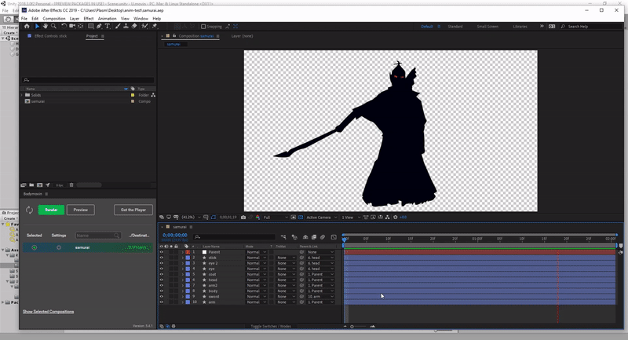

# Bringing After Effects shape animations to Unity.

Inspired by the [Lottie](https://github.com/airbnb/lottie-web) frameworks, which utilize animation data from After Effects to create animated vector graphics on native platforms. 
  
With the help of Unity's [Vector Graphics](https://docs.unity3d.com/Packages/com.unity.vectorgraphics@1.0/manual/index.html) package, this library brings [the same](https://www.lottiefiles.com/) to Unity.


## Examples



  

  
## Features

Currently supports animation for: 

- Shape paths
- Shape fill color
- Shape stroke color
- Layer anchor points
- Layer position
- Layer rotation (X, Y, Z)
- Layer scale
- Layer opacity 
- Blending between compositions
- Single layer precompositions **[IN PROGRESS]**  


# Usage

**First**, use the [Bodymovin extension](https://creative.adobe.com/addons/products/12557) in After Effects to export your composition.

**Second**, enable [Vector Graphics](https://docs.unity3d.com/Packages/com.unity.vectorgraphics@1.0/manual/index.html) from the `Package Manager` in Unity.

**Third**, add the [exported](https://www.youtube.com/watch?v=5XMUJdjI0L8) `json` to your Resources folder.   


## Editor

Add a `Movin Renderer` component to your GameObject, and point the `resourcePath` to your json file (located under **Resources**)


## Script instantiation

```
Movin mov = new Movin(transform, "json/samurai");
mov.Play();
```

Pass your GameObject's `transform` as a parameter, followed by the `json path` (located under **Resources**)


#### Optional parameters

`Sort [Int]`: Order in layer  
`Scale [Float]`: Scale of rendered composition  
`Stroke Width [Float]`: Width of AE strokes  
`Loop [Bool]`: Should the composition loop  
`Quality [Float (0.01 - 1.0)]`: Quality of the shapes drawn (lower is better)  


## TODO

- Concurrent playing composition blending
- Nested Precomps
- Masking / Alpha Mattes
- Parametric shapes
- Stroke size, width, opacity
- Fill opacity
- Time remapping
- Animating bitmap layers
- Blend mode support